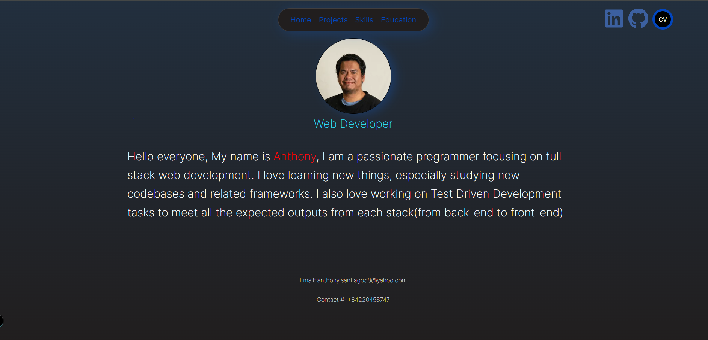
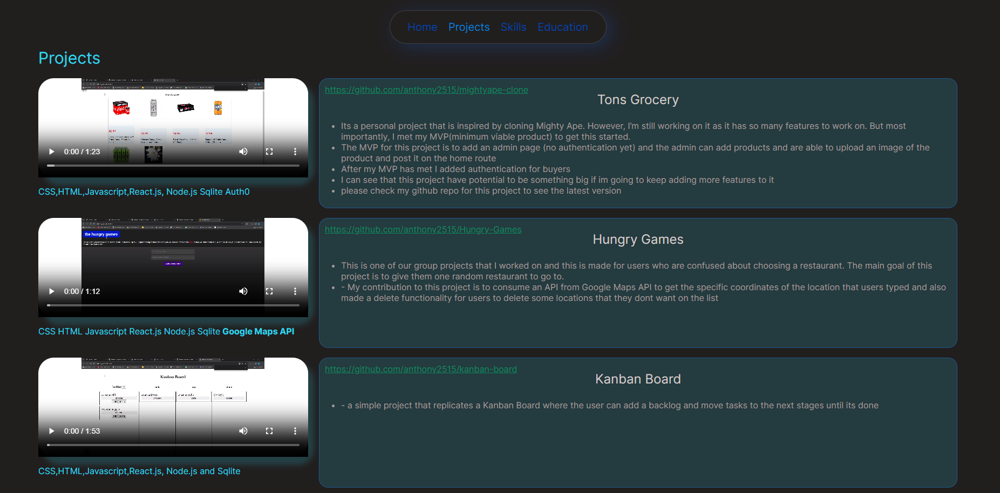
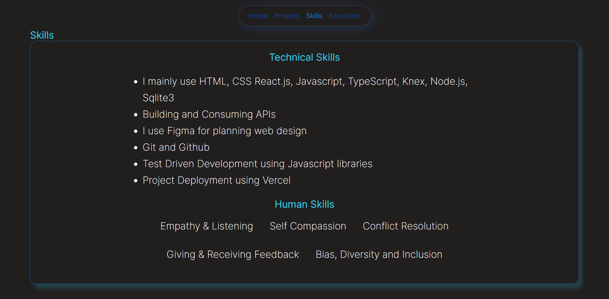
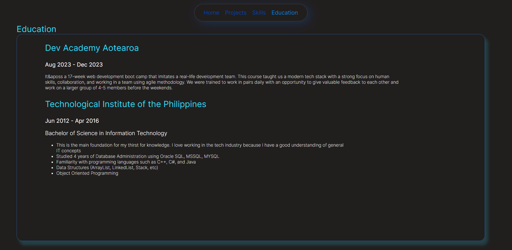

<h1>Hello Everyone</h1>
<h2>Welcome to my landing page</h2>

On this page, you can see 3 sections:

<ul>
<li>Home section</li>
<li>Projects</li>
<li>Skills</li>
<li>Education</li>
</ul>

<h1>Home Section</h1>

The first things that you can see when you go to my landing page is the home section. Where you can see a <strong>navigation bar</strong> that will navigate you on a certain section of the page when you clicked it.

At the top-right corner you can see my linkedIn profile, github page and you can dowload my CV by clicking the logo.

<h1>Projects</h1>

Here you can see 3 projects that I made. Each project shows the description and the tools that I used for developing and a github link which is associated for each projects. And you can also play the video to see the demonstration

<h1>Skills Section</h1>

This section shows my skills on technical and non technical skills(human skills)

<h1>Education Section</h1>

This section shows my educational background

<h1>That's all!</h1>

Thank you for taking your time to read this documentation. Have a great day
